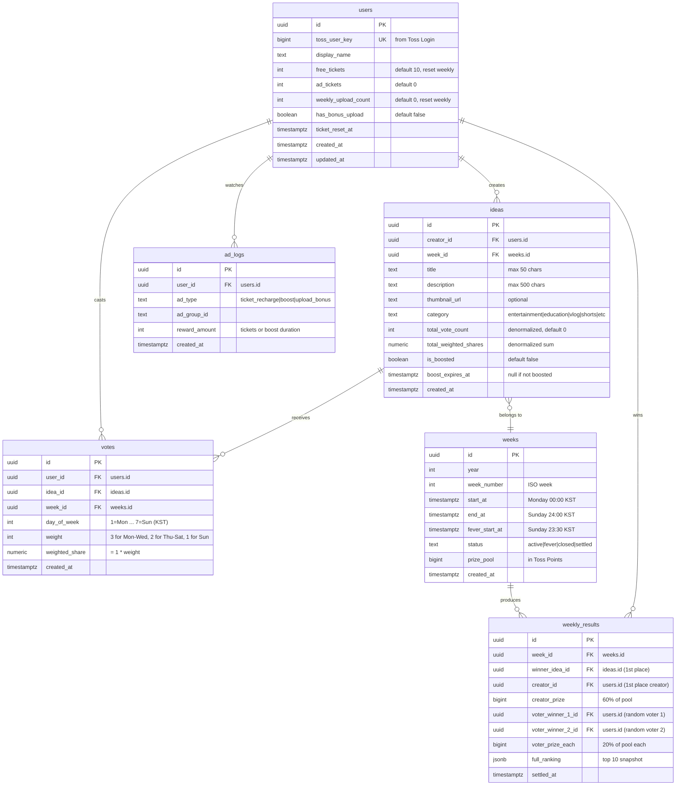

# YouTube Content Idea Voting MiniApp - Technical Specification

---

## 1. Tech Stack & State Management Strategy

### Core Stack

- **Framework:** React 18 + Vite + TypeScript (strict mode)
- **Toss SDK:** `@apps-in-toss/web-framework` (SDK 2.x) -- provides `GoogleAdMob`, `grantPromotionReward`, `appLogin`
- **TDS UI:** `@toss/tds-mobile` -- mandatory for non-game WebView mini-apps (검수 필수)
- **Styling:** Tailwind CSS 3.x (mobile-first, `max-w-md mx-auto min-h-screen`)
- **Routing:** React Router DOM v6 (in-app only, no external links)
- **Client State:** Zustand -- tickets, UI state, fever-time countdown, ad loading status
- **Server State:** TanStack React Query v5 -- ideas feed, votes, rankings, user profile
- **Backend:** Supabase (Postgres + Edge Functions + Realtime subscriptions)
- **Build/Deploy:** `granite.config.ts` via `@apps-in-toss/web-framework`, `ait init`, `granite build`

### Key Toss SDK APIs Used

- **Login:** `appLogin()` from `@apps-in-toss/web-framework` -> returns `authorizationCode` + `referrer`
- **Rewarded Ad (통합 광고 2.0):** `loadFullScreenAd` / `showFullScreenAd` from `@apps-in-toss/web-framework` — 리워드는 `userEarnedReward`에서만 지급 처리 (`dismissed` 단독 시 미지급). 래퍼: `src/utils/tossBridge.ts`
- **Toss Points:** `grantPromotionReward({ params: { promotionCode, amount } })` for prize payout (server-side S2S recommended for anti-fraud)
- **Share:** `contactsViral` for share-reward flow (deep link `intoss://{appName}/...`)

### State Architecture

```
Zustand Store (volatile, client-only)
├── useAuthStore: { tossUserKey, accessToken, isLoggedIn }
├── useTicketStore: { freeTickets, adTickets, weeklyReset timestamp }
├── useUIStore: { isFeverTime, feedView, activeTab, toasts }
└── useAdStore: { adLoadStatus, isAdPlaying }

React Query (server state, cached)
├── useIdeasFeed: GET /ideas?week=current (infinite scroll)
├── useIdeaDetail: GET /ideas/:id (with vote stats if voted)
├── useMyVotes: GET /votes?userId=me&week=current
├── useRanking: live `mv_live_ranking` (탭·라우트: KST 일요일 23:30~24:00만, 당겨서 새로고침)
├── useMyIdeas: GET /ideas?creatorId=me
└── useWeeklyResult: GET /weeks/:weekId/result
```

### Routing Strategy (React Router v6)

All routes are in-app only. No `window.open`, `location.href`, or `target="_blank"`.

| Path              | Page                                             | Access      |
| ----------------- | ------------------------------------------------ | ----------- |
| `/`               | Redirect to `/feed`                              | All         |
| `/feed`           | Swipe-style idea feed (Dark Zone applied)        | All         |
| `/idea/:id`       | Idea detail + vote action                        | All         |
| `/upload`         | Submit new idea (max 7/week, 리워드 광고 후 제출) | Logged in   |
| `/my`             | My dashboard (votes, ideas, tickets)             | Logged in   |
| `/my/ideas`       | My created ideas (with rank/probability visible) | Logged in   |
| `/ranking`        | 실시간 랭킹 · KST 일 23:30~24:00만 탭/직접 진입, 당겨서 새로고침 (자동 폴링 없음) | 조건부 |
| `/result`         | 최신 정산 주차로 리다이렉트 (`settled` 없으면 안내) | All         |
| `/result/:weekId` | 해당 주 `weekly_results` + 우승 아이디어 · 상금   | All         |

---

## 2. Directory Architecture

```
src/
├── main.tsx                          # React root + QueryClientProvider + RouterProvider
├── App.tsx                           # Layout shell (TDS Top bar, bottom nav)
├── granite.config.ts                 # Apps-in-Toss config (appName, brand, web)
├── vite.config.ts
├── index.html
├── components/
│   ├── common/
│   │   ├── BottomNav.tsx             # 피드 | 업로드 | 마이
│   │   ├── Toast.tsx                 # Global toast (Zustand-driven)
│   │   ├── TicketBadge.tsx           # Remaining tickets display
│   │   ├── ProbabilityGauge.tsx      # Animated % gauge (dopamine UX)
│   │   ├── AdRewardButton.tsx        # "Watch Ad" CTA (load->show pattern)
│   │   ├── LoadingSpinner.tsx
│   │   └── ConfirmModal.tsx          # Non-retractable vote confirmation
│   ├── feed/
│   │   ├── IdeaCard.tsx              # Card in feed (blinded rank/views)
│   │   ├── IdeaCardVoted.tsx         # Card after voting (shows rank/prob)
│   │   └── SwipeFeed.tsx             # Vertical swipe container
│   ├── idea/
│   │   ├── IdeaDetail.tsx            # Full idea view
│   │   ├── VoteAction.tsx            # Vote button + ticket deduction
│   │   └── BoostButton.tsx           # Creator's Ad-for-Boost CTA
│   ├── ranking/
│   │   ├── FeverBanner.tsx           # Countdown timer banner
│   │   ├── RankingList.tsx           # Top 10 live ranking
│   │   └── RankingCard.tsx           # Individual rank item
│   └── result/
│       ├── WeeklyResult.tsx          # Winner announcement
│       └── PrizeBreakdown.tsx        # 60/40 split visualization
├── pages/
│   ├── FeedPage.tsx
│   ├── IdeaDetailPage.tsx
│   ├── UploadPage.tsx
│   ├── MyPage.tsx
│   ├── MyIdeasPage.tsx
│   ├── RankingPage.tsx
│   └── ResultPage.tsx
├── hooks/
│   ├── useAuth.ts                    # appLogin -> token exchange -> userKey
│   ├── useVote.ts                    # Vote mutation + optimistic update + rollback
│   ├── useTickets.ts                 # Ticket balance logic (free + ad)
│   ├── useRewardedAd.ts             # GoogleAdMob load/show lifecycle hook
│   ├── useBoost.ts                   # Creator boost ad + API call
│   ├── useFeverTime.ts              # Checks if current time is Sun 23:30~00:00
│   ├── useProbability.ts            # Real-time probability subscription
│   └── useWeekCycle.ts              # Current week ID, day-of-week weight
├── services/
│   ├── supabase.ts                   # Supabase client init
│   ├── authService.ts                # Token exchange (S2S via Edge Function proxy)
│   ├── ideaService.ts                # CRUD for ideas
│   ├── voteService.ts                # Vote creation + probability recalc trigger
│   ├── adLogService.ts               # Log ad views for audit
│   ├── rewardService.ts              # Prize distribution (S2S promotion API)
│   └── rankingService.ts             # Ranking queries + realtime subscription
├── store/
│   ├── authStore.ts
│   ├── ticketStore.ts
│   ├── uiStore.ts
│   └── adStore.ts
├── types/
│   ├── idea.ts                       # IIdea, IIdeaCreate, IIdeaFeed
│   ├── vote.ts                       # IVote, IVoteCreate
│   ├── user.ts                       # IUser, IAuthState
│   ├── ranking.ts                    # IRanking, IWeeklyResult
│   ├── ad.ts                         # IAdLog, AdLoadStatus
│   └── week.ts                       # IWeek, DayWeight
├── utils/
│   ├── tossBridge.ts                 # Abstracted Toss SDK bridge calls
│   ├── probability.ts                # calculateWinProbability pure function
│   ├── weekCycle.ts                  # getWeekId, getDayWeight, isFeverTime
│   ├── constants.ts                  # FREE_TICKETS=10, BOOST_DURATION=3600, etc.
│   └── format.ts                     # % formatting, date formatting
├── styles/
│   └── globals.css                   # Tailwind base + Toss overrides (overscroll, scrollbar hide)
└── mocks/
    ├── tossSdkMock.ts                # Mock GoogleAdMob, appLogin for local dev
    └── mockData.ts                   # Seed ideas, users for testing
```

---

## 3. Database Schema (Supabase Postgres)

### ERD Diagram



### Critical Indexes

```sql
-- Fast lookup: one vote per user per idea (uniqueness + query)
CREATE UNIQUE INDEX idx_votes_user_idea ON votes(user_id, idea_id);

-- Probability calculation: sum weighted_shares per idea
CREATE INDEX idx_votes_idea_weight ON votes(idea_id) INCLUDE (weighted_share);

-- Feed query: ideas for current week, sorted by creation (with boost priority)
CREATE INDEX idx_ideas_week_created ON ideas(week_id, created_at DESC);
CREATE INDEX idx_ideas_week_boosted ON ideas(week_id, is_boosted, boost_expires_at);

-- Ranking query: top ideas by total_weighted_shares in a week
CREATE INDEX idx_ideas_week_ranking ON ideas(week_id, total_weighted_shares DESC);

-- User's votes in current week
CREATE INDEX idx_votes_user_week ON votes(user_id, week_id);

-- Weekly ticket reset check
CREATE INDEX idx_users_ticket_reset ON users(ticket_reset_at);
```

### Row-Level Security (RLS) Policies

```sql
-- Users can only read their own profile and update their own tickets
-- Ideas are readable by all, writable only by creator
-- Votes: INSERT only (no UPDATE/DELETE -- non-retractable)
-- Votes: users can only read own votes + aggregates
-- Ranking data: readable only during fever time or by voters/creators (enforced via Edge Function)
```

---

## 4. Core Algorithms & Concurrency Control

### 4.1 Win Probability Calculation

```typescript
// src/utils/probability.ts

interface ProbabilityInput {
  myWeightedShare: number;        // user's weighted_share for this idea
  ideaTotalWeightedShares: number; // ideas.total_weighted_shares (denormalized)
}

function calculateWinProbability(input: ProbabilityInput): number {
  const { myWeightedShare, ideaTotalWeightedShares } = input;
  if (ideaTotalWeightedShares === 0) return 0;
  return (myWeightedShare / ideaTotalWeightedShares) * 100;
  // Returns percentage, e.g., 12.5 means 12.5%
}
```

### 4.2 Day-of-Week Weight Assignment

```typescript
// src/utils/weekCycle.ts

function getDayWeight(date: Date = new Date()): number {
  // Convert to KST (UTC+9)
  const kstDate = new Date(date.getTime() + 9 * 60 * 60 * 1000);
  const day = kstDate.getUTCDay(); // 0=Sun, 1=Mon, ..., 6=Sat

  if (day >= 1 && day <= 3) return 3; // Mon-Wed: 3x
  if (day >= 4 && day <= 6) return 2; // Thu-Sat: 2x
  return 1;                            // Sun: 1x
}
```

### 4.3 Vote Transaction (Supabase Edge Function -- atomic)

This is the most critical path. A single vote must atomically:

1. Verify user has tickets and hasn't voted on this idea
2. Deduct 1 ticket
3. Insert vote row with calculated weight
4. Update `ideas.total_weighted_shares` and `ideas.total_vote_count`

```typescript
// supabase/functions/cast-vote/index.ts (Edge Function)
// Uses Supabase service_role key for transactional writes

async function castVote(userId: string, ideaId: string) {
  const supabase = createClient(SUPABASE_URL, SUPABASE_SERVICE_ROLE_KEY);

  // Single transaction via Postgres function (RPC call)
  const { data, error } = await supabase.rpc('cast_vote_atomic', {
    p_user_id: userId,
    p_idea_id: ideaId,
  });
  // Returns: { success: boolean, newProbability: number, error?: string }
}
```

```sql
-- Postgres function for atomic vote
CREATE OR REPLACE FUNCTION cast_vote_atomic(
  p_user_id UUID,
  p_idea_id UUID
) RETURNS JSONB AS $$
DECLARE
  v_week_id UUID;
  v_free_tickets INT;
  v_ad_tickets INT;
  v_day_weight INT;
  v_existing_vote UUID;
  v_new_total NUMERIC;
  v_user_share NUMERIC;
BEGIN
  -- 1. Check existing vote (UNIQUE constraint also guards this)
  SELECT id INTO v_existing_vote FROM votes
    WHERE user_id = p_user_id AND idea_id = p_idea_id;
  IF v_existing_vote IS NOT NULL THEN
    RETURN jsonb_build_object('success', false, 'error', 'ALREADY_VOTED');
  END IF;

  -- 2. Get current week
  SELECT id INTO v_week_id FROM weeks
    WHERE status IN ('active', 'fever') ORDER BY start_at DESC LIMIT 1;

  -- 3. Check & deduct tickets (prefer free tickets first)
  SELECT free_tickets, ad_tickets INTO v_free_tickets, v_ad_tickets
    FROM users WHERE id = p_user_id FOR UPDATE; -- row lock

  IF v_free_tickets <= 0 AND v_ad_tickets <= 0 THEN
    RETURN jsonb_build_object('success', false, 'error', 'NO_TICKETS');
  END IF;

  IF v_free_tickets > 0 THEN
    UPDATE users SET free_tickets = free_tickets - 1 WHERE id = p_user_id;
  ELSE
    UPDATE users SET ad_tickets = ad_tickets - 1 WHERE id = p_user_id;
  END IF;

  -- 4. Calculate day weight (KST)
  v_day_weight := CASE EXTRACT(DOW FROM NOW() AT TIME ZONE 'Asia/Seoul')
    WHEN 1 THEN 3 WHEN 2 THEN 3 WHEN 3 THEN 3  -- Mon-Wed
    WHEN 4 THEN 2 WHEN 5 THEN 2 WHEN 6 THEN 2  -- Thu-Sat
    ELSE 1                                         -- Sun
  END;

  -- 5. Insert vote
  INSERT INTO votes (user_id, idea_id, week_id, day_of_week, weight, weighted_share)
  VALUES (p_user_id, p_idea_id, v_week_id,
    EXTRACT(DOW FROM NOW() AT TIME ZONE 'Asia/Seoul'),
    v_day_weight, v_day_weight);

  -- 6. Update idea denormalized counters
  UPDATE ideas SET
    total_vote_count = total_vote_count + 1,
    total_weighted_shares = total_weighted_shares + v_day_weight
  WHERE id = p_idea_id
  RETURNING total_weighted_shares INTO v_new_total;

  -- 7. Calculate user's probability
  v_user_share := v_day_weight;
  RETURN jsonb_build_object(
    'success', true,
    'probability', ROUND((v_user_share / v_new_total) * 100, 2),
    'weight', v_day_weight
  );
END;
$$ LANGUAGE plpgsql;
```

### 4.4 Fever Time Concurrency Strategy

During Fever Time (Sunday 23:30-00:00 KST), thousands of users vote simultaneously.

**Problem:** Direct writes to `ideas.total_weighted_shares` cause row-level lock contention.

**Solution: Write-Ahead + Periodic Aggregation**

1. **Votes table is append-only** -- INSERT never blocks on other inserts (no row-level contention on votes table itself)
2. **Denormalized counter update** uses `UPDATE ... SET total_weighted_shares = total_weighted_shares + N` which Postgres handles well with row-level locks (brief lock, no deadlock)
3. **Probability reads** during fever time use a **materialized view** refreshed every 5 seconds by a Supabase cron job:

```sql
-- Materialized view for ranking (refreshed every 5s during fever)
CREATE MATERIALIZED VIEW mv_live_ranking AS
  SELECT
    i.id AS idea_id,
    i.title,
    i.total_weighted_shares,
    i.total_vote_count,
    RANK() OVER (ORDER BY i.total_weighted_shares DESC) AS rank
  FROM ideas i
  WHERE i.week_id = (SELECT id FROM weeks WHERE status IN ('active','fever') LIMIT 1)
  ORDER BY total_weighted_shares DESC
  LIMIT 10;

-- pg_cron job (every 5 seconds during fever time window)
SELECT cron.schedule('refresh_ranking', '*/5 * * * *',
  $$REFRESH MATERIALIZED VIEW CONCURRENTLY mv_live_ranking$$);
```

1. **Client-side:** During fever time, subscribe to Supabase Realtime on `mv_live_ranking` changes, or poll every 5 seconds via React Query with `refetchInterval: 5000`.
2. **Optimistic updates on client:** When a user votes, immediately calculate the new probability locally and show it, then reconcile with server response.

### 4.5 Weekly Settlement

**DB (구현됨):** `public.settle_week(p_week_id uuid)` — `SECURITY DEFINER`, `service_role`만 실행. 대상 `weeks.status`는 `fever` 또는 `closed`, 동일 `week_id`로 `weekly_results`가 없을 때만 처리.

1. 1위 아이디어: 해당 주 `ideas`를 `total_weighted_shares` 등으로 정렬해 1건
2. 상금: `prize_pool` 기준 창작자 60%, 투표 당첨 2인 각 20% (내림)
3. 투표 당첨: 우승 `idea_id`에 대한 `votes`를 `user_id`별 가중치 합산 후 2인 추첨(무복원)
4. `full_ranking`: 상위 10개 아이디어 JSON
5. `weekly_results` insert 후 `weeks.status = 'settled'`

**운영(부분):** `try_run_weekly_settlement_kst()` — KST **월요일 00:00~06:00**(앱 점검 창과 동일)에만 동작, 미정산 `fever|closed` 주차 1건에 대해 `settle_week` 호출 후 `refresh_live_ranking()`. pg_cron 또는 Edge `weekly-settlement`(Bearer `CRON_SECRET`)로 해당 구간 안에서 주기 호출.

**미연결:** 다음 주차 `weeks` `active` 행 생성은 수동/별도 RPC. 사용자 티켓/업로드 리셋은 같은 창의 `try_weekly_user_reset_kst`.

**토스 지급(미구현):** `execute-promotion` 등 S2S는 Edge에서 `settle_week` 반환값(금액·수령 user id)을 받아 호출.

### 4.6 Weighted Random Voter Selection (for prize drawing)

```sql
-- Select 2 random voters weighted by their weighted_share
WITH voter_pool AS (
  SELECT user_id, weighted_share,
    SUM(weighted_share) OVER (ORDER BY random()) AS cumulative
  FROM votes
  WHERE idea_id = :winning_idea_id
),
total AS (
  SELECT SUM(weighted_share) AS total_share FROM votes WHERE idea_id = :winning_idea_id
)
SELECT user_id FROM voter_pool, total
WHERE cumulative <= total_share * random()
ORDER BY random()
LIMIT 2;
```

(In practice, use the classic weighted reservoir sampling in the Edge Function for correctness.)

### 4.7 Rewarded Ad Flow (Toss SDK Integration)

구현은 **통합 광고 2.0** API(`loadFullScreenAd` / `showFullScreenAd`)를 `tossBridge`로 감싼 뒤 `useRewardedAd`에서 사용한다. 광고 단가/그룹은 `VITE_AD_GROUP_ID` 및 화면별 `adGroupId` 오버라이드.

**티켓 충전 / 업로드 제출 전 광고** 완료 후 지급은 **Supabase RPC** `reward_ticket_recharge`로 처리한다(`adLogService`). 클라이언트 → Edge Function으로 티켓을 더하는 별도 경로는 두지 않는다.

(레거시 스니펫: 예전 `GoogleAdMob.loadAppsInTossAdMob` 예시는 SDK 2.x 통합 광고로 대체됨.)

---

## 5. Step-by-Step Implementation Milestones

### Milestone 1: Project Scaffolding & Toss SDK Setup

- Scaffold Vite React TS project (`npm create vite@latest`)
- Install `@apps-in-toss/web-framework`, `@toss/tds-mobile`
- Run `npx ait init`, configure `granite.config.ts`
- Install Tailwind CSS, Zustand, React Query, React Router DOM
- Set up `globals.css` with Toss constraints (`overscroll-behavior-y: none`, `user-select: none`, scrollbar hide)
- Create `src/mocks/tossSdkMock.ts` for local dev

### Milestone 2: Supabase Setup & DB Schema

- Create Supabase project
- Execute all `CREATE TABLE` statements with indexes
- Set up RLS policies
- Create `cast_vote_atomic` Postgres function
- Create materialized view `mv_live_ranking`
- Set up `supabase.ts` client in `src/services/`

### Milestone 3: Auth & User Management

- Implement `useAuth` hook with `appLogin()` flow
- Create Edge Function proxy for token exchange (S2S)
- Implement Zustand `authStore` with `tossUserKey`, `accessToken`
- Auto-login on app mount, persist session
- User record upsert on first login

### Milestone 4: Type Definitions & Service Layer

- Define all interfaces in `src/types/`
- Implement `ideaService.ts`, `voteService.ts`, `rankingService.ts`, `adLogService.ts`
- Set up React Query hooks with proper cache keys and stale times

### Milestone 5: Swipe Feed & Dark Zone UI

- Build `SwipeFeed.tsx` with infinite scroll (React Query `useInfiniteQuery`)
- Build `IdeaCard.tsx` with blinded rank/views (Dark Zone default)
- Build `IdeaCardVoted.tsx` showing rank + probability (post-vote)
- Implement boost priority sorting (boosted ideas 1.5x exposure weight)

### Milestone 6: Vote Action & Ticket System

- Build `VoteAction.tsx` with non-retractable confirmation modal
- Implement `useVote` hook with optimistic update + rollback
- Implement `useTickets` hook (free + ad tickets, weekly reset check)
- Build `TicketBadge.tsx` component
- Build `ProbabilityGauge.tsx` with animated percentage

### Milestone 7: Rewarded Ad Integration

- Implement `useRewardedAd` hook (통합 광고 2.0, `tossBridge`)
- Build `AdRewardButton.tsx` (ticket recharge flow)
- Implement ad logging (`adLogService.ts`)
- Connect ad completion → `reward_ticket_recharge` RPC (+ `ad_logs`)

### Milestone 8: Idea Upload & Creator Dashboard

- Build `UploadPage.tsx` (max 7/week, 제출마다 리워드 광고, 상한 초과 시 토스트만)
- Build `BoostButton.tsx` (ad -> boost activation)
- Build `MyIdeasPage.tsx` with creator-only rank/probability visibility
- Implement boost expiry logic (server-side `boost_expires_at` check)

### Milestone 9: Fever Time & Live Ranking + Monday Maintenance UI

- `useFeverMode` / `feverWindowKst`: `weeks.status === 'fever'` and/or KST Sunday 23:30–24:00
- `FeverBanner.tsx` + countdown; `RankingPage` KST 일 23:30~24:00만 열람, 당겨서 새로고침 (자동 폴링 없음)
- 피드·랭킹은 하단 탭으로 사용자 선택; 피버 시 자동 리다이렉트 없음
- Monday 00:00–06:00 KST: global `MaintenancePage` only (no `BottomNav`)
- DB: `try_weekly_user_reset_kst` during same Monday window (see migrations)

### Milestone 10: Weekly Settlement & Prize Distribution

- Create Supabase scheduled Edge Function for Monday 00:01 settlement
- Implement weighted random voter selection algorithm
- Integrate Toss Promotion S2S API for prize payout (`execute-promotion`)
- Build `ResultPage.tsx` with winner display and prize breakdown
- Implement weekly reset: tickets, upload counts, new week row

### Milestone 11: Polish, Animation & UX

- Add micro-animations (vote confirmation burst, probability counter, rank change)
- Add haptic-like feedback via CSS transitions
- Add skeleton loading states for feed
- Add error boundaries and offline handling
- TDS component integration audit (buttons, text, layout match Toss guidelines)

### Milestone 12: Testing & Deployment

- Test in Toss Sandbox app (iOS simulator + Android via ADB)
- Verify all SDK calls work in sandbox (`GoogleAdMob.isSupported()` checks)
- Fever time load testing (simulate concurrent votes)
- `granite build` -> upload `.ait` bundle to Toss Console
- QR code testing in Toss App
- Submit for Toss review (검수)
